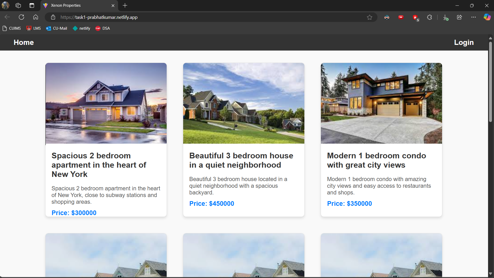
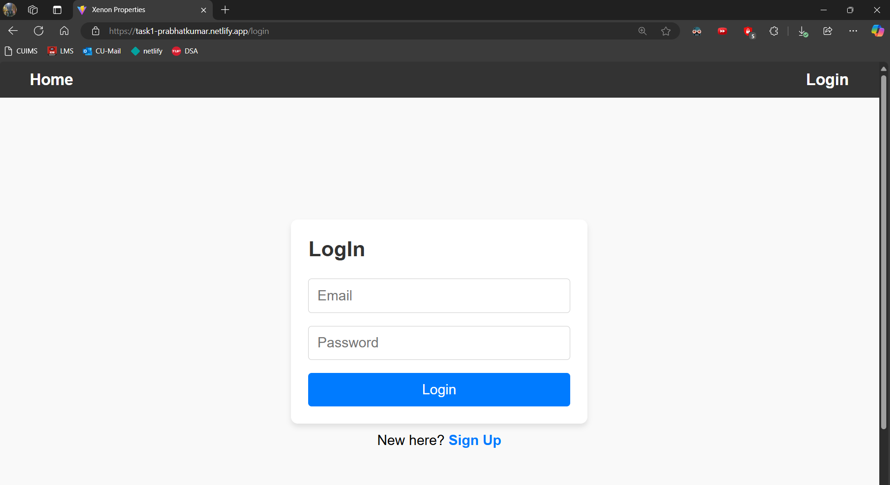
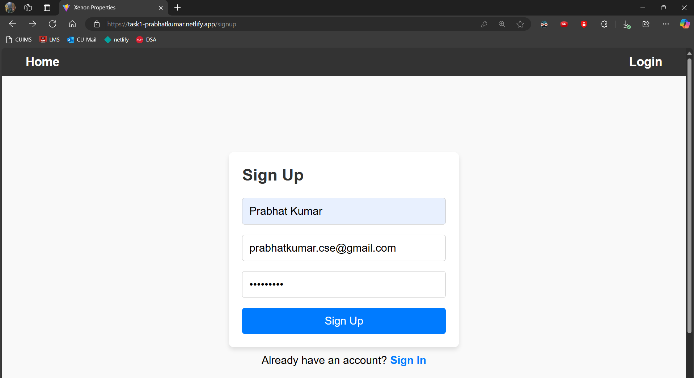
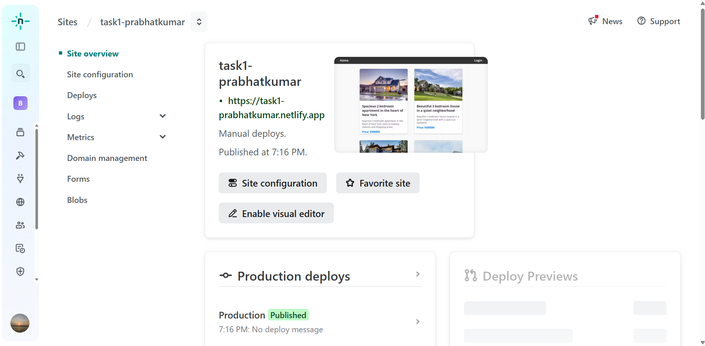
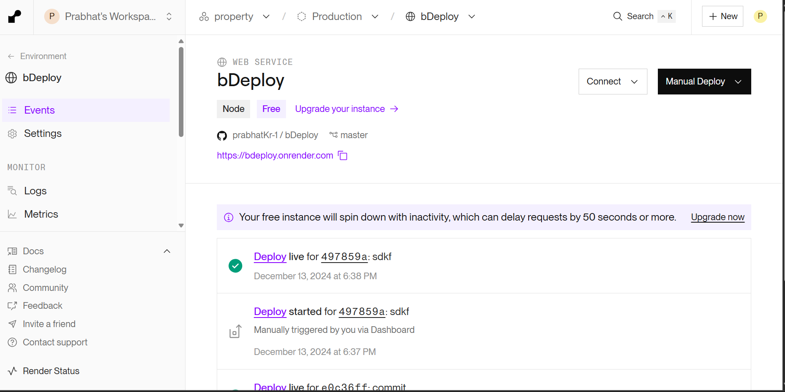
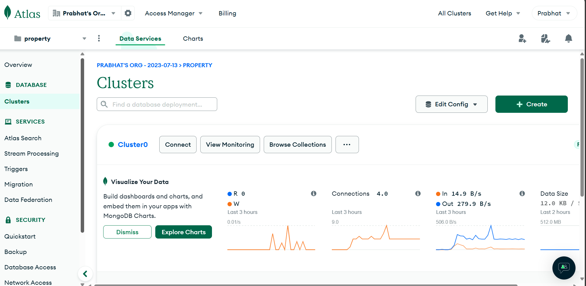

# Real Estate Web Application

## Introduction

This project is a real estate web application designed using the MERN (MongoDB, Express, React, Node.js) stack. The application allows users to view property listings for sale or rent, log in and out, and receive personalized property recommendations based on browsing history and preferences using an AI algorithm. The app is fully responsive and is hosted on Netlify 

## Features

- **User Authentication**: Login and logout functionality with a secure authentication flow.
- **Property Listing Page**: Detailed listings of properties fetched from the database, where users can browse properties for sale or rent.
- **AI-Driven Property Recommendations**: Personalized property suggestions based on the user's browsing history and preferences.
- **Responsive Design**: The application is designed to be fully responsive on both desktop and mobile devices.
- **Hosting**: The project is deployed and accessible through a hosted URL.

## Technologies Used

### Frontend

- **React**: A JavaScript library for building user interfaces. React was used to create dynamic, single-page applications with smooth user experiences.
- **HTML & CSS**: For building the structure and styling the web pages.
- **JavaScript**: For adding interactivity and handling logic in the frontend.

### Backend

- **Node.js**: A JavaScript runtime environment for building scalable and efficient backend services. Node.js was used to handle server-side logic, API requests, and routing.
- **Express.js**: A web framework for Node.js that simplifies routing, middleware handling, and other backend tasks.
- **MongoDB**: A NoSQL database used to store user data, property listings, and user preferences. MongoDB was chosen for its flexibility and scalability in handling large datasets.
  

### Deployment

- **Netlify**: The application is deployed on Netlify for easy hosting and scalability. You can access the live version of the application here: https://task1-prabhatkumar.netlify.app/

- **Render**: The backend of the application is deployed on Render for easy hosting. Render provides hosting of web services and it also has a free tier.


### Other Tools

- **GitHub**: Version control was handled using GitHub to manage the codebase and track changes.
- **Postman**: Used for testing the API endpoints during development.

## How to Run the Project Locally

### Prerequisites

- Node.js and npm installed on your machine.
- MongoDB installed or a MongoDB cloud instance (like Atlas).

### Steps

1. Clone the repository:

    ```bash
    git clone https://github.com/yourusername/real-estate-web-app.git
    cd real-estate-web-app
    ```

2. Install backend dependencies:

    ```bash
    cd backend
    npm install
    ```

3. Install frontend dependencies:

    ```bash
    cd frontend
    npm install
    ```

4. Set up your MongoDB database and configure environment variables (e.g., `MONGO_URI`, `JWT_SECRET`).

5. Start the backend server:

    ```bash
    cd backend
    npm start
    ```

6. Start the frontend server:

    ```bash
    cd frontend
    npm start
    ```

The application will be accessible at `http://localhost:3000`.


## Screenshots

Below are the screenshots showing the key features of the project:
- **Property Listings**:
- 
  

- **Login Page**:
- 
  

- **SignUp Page**:
- 
  

- **Front-end Deployment**:
- 
  

- **Back-end Deployment**:
- 
  

- **MongoDB**:
- 
  

## Project Structure

The project is divided into two main directories:

- **`frontend/`**: Contains the React application that handles the user interface.
- **`backend/`**: Contains the Node.js/Express backend that handles API requests and interacts with MongoDB.


--------------------------!! THANK YOU !!--------------------------------------
